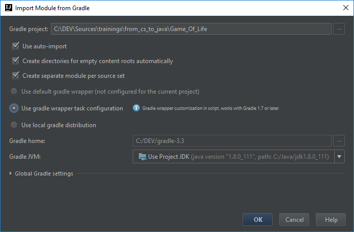

# The Game of Life

## Life-cycle

In the current section, we're going to illustrate the different parts of the
life-cycle of the Java development: edition, compilation, execution, debugging,
verification, management of dependencies, packaging and distribution, and the
interface with the host platform.

### Structure

This is part is focused on practice. Each aspects will be first shown then be
applied. The practice structure is the following:

* problem: the [game of life](https://en.wikipedia.org/wiki/Conway%27s_Game_of_Life)
* ping-pong programming
* organized in session of about 1 hour:

  * introduction
  * practice
  * retrospective
  * break

## Tools

Before coding, let's discover some tools to allow us to efficiently code the game of life.

### IntelliJ IDEA

A java code is a simple set of text files. A text editor to edit java files and a command line
to compile them are in theory sufficient to make a java project. Of course, an IDE is very helpful
when coding.

Three major IDE are used to develop in Java: NetBeans, Eclipse and IntelliJ. IntelliJ is the most
advanced one, here is a [presentation of IntelliJ](../IntelliJ/README.md).  

### Gradle

Gradle is a build tools largely used to enforce project structure and allow build automation.
Quite all java projects are based today on build tools like Gradle or Maven. 
Here is a [presentation of Gradle](../gradle_build_tool/README.md)

## The project

### Session 1: Basics

#### Create a new Gradle project in IntelliJ

1. In the "Welcome to IntelliJ IDEA" window, click the "Create New Project"
   option.
2. In the "New Project" dialog, select "Gradle", the project SDK, and check
   Java as "Additional Libraries and Frameworks". Click "Next".
   
   
3. Fill at least the "ArtificatId" field, that is the name of the project.

   
4. In the "New Project" Gradle dialog, check the "auto-import", "create directories"
 and "Create separate module" checkboxes and select "Use gradle wrapper task configuration".
 
   
5. Click "Next". Correct the "Project Name" and "Project location" if they don't
   suit you.
   
   
6. Click "Finish". IntelliJ will automatically create its project artifacts
   based on the information provided.
   
   

#### A minimal Gradle build script

You'll find in the `template` a minimum scaffold of a Java project with a Gradle
build script `build.gradle`:

```Gradle
group 'com.evs.training'
version '1.0-SNAPSHOT'

task wrapper(type: Wrapper) {
  gradleVersion = '3.3'
  distributionUrl = "https://services.gradle.org/distributions/gradle-$gradleVersion-all.zip"
}

apply plugin: 'java'

sourceCompatibility = 1.8

repositories {
    mavenCentral()
}

dependencies {
    testCompile group: 'junit', name: 'junit', version: '4.12'
}
```

#### Write code in IntelliJ

##### The standard Maven directory layout

The [standard Maven directory layout](http://maven.apache.org/guides/introduction/introduction-to-the-standard-directory-layout.html)
is the following:

* `src/main/java`: Code sources
* `src/test/java`: Test sources
* `src/main/resources`: resources
* `src/test/resources`: Test resources

By default, the plugin creates the structure for you. You can now create the package structure 
in the project panel:

1. Right click on the target folder
2. Submenu "New"
3. Item "Directory" if you are in a "resources" folder or item "package" if you are
in a "java" folder.

> Be careful when creating packages, you have 
to create them one per one, if you specify "com.evs" as package name, only one folder named
"com.evs" will be created instead of a hierarchy of two folders.

##### Add a new source file

You can create a new source file as following:

1. Right click on the target folder
2. Submenu "New"
3. Item "Java Class"
4. Select the type of class to create (class, interface, Enum,...)

##### Edit and your file

Double click on the source file you want to edit. By default, IntelliJ saves files at each
context change (lose focus, build, run, ...) 

#### Compile the project

##### With `javac`

When you just have a command line, you can use `javac` from your JDK to compile your code:

```Bash
javac -d <output_dir> <filename.java>
```

##### With Gradle

In the console, you run the program as following in the folder containing your build.gradle file:

```Bash
gradlew build
```

##### With IntelliJ

You can either do:

* Menu "Build"
* Click Item "Make Project" or use the shortcut `Ctrl + F9`

or

* open the Gradle panel
* Select "Tasks", "build"
* Double-click "Build"

#### Execute the program

##### With `java`

To run a program, you can do:

```Bash
java -cp <classpath> <class_name_containing_main_function>
```
The `classpath` is a list of directories containing `.class` files and `.jar`
files separated by `:` on *nix system and `;` on Windows system.

##### With Gradle

In the console, you run the program as following:

```Bash
gradlew run
```

##### With IntelliJ

To run the program you can do either

* Go in the `main` method
* Type `Ctrl + Shift + F10` or click on the green triangle beside the main method

or

* Menu "Run"
* Item "Edit configurations"
* In the "Run/Debug Configurations" dialog

  * Click on the "+"
  * Select "Application"
  * Fill the "Name field"
  * Select the main class
  * Click "Apply"

* Menu "Run"
* Item "Run ..."
* Select the application with the name you gave it

or

* open the Gradle panel
* Select "Tasks", "application"
* Double-click "Run"


### Session 2: Testing

#### Junit

Junit is an external library, by default, the plugin has added it in your build.gradle file

```Gradle
dependencies {
    testCompile group: 'junit', name: 'junit', version: '4.12'
}
```

You can also tell what you want to log during your tests:

```Gradle
test {
  testLogging {
    events "passed", "skipped", "failed", "standardOut", "standardError"
  }
}
```

Then you can create your first test into `src/test/java`. By convention, unit tests foe a class
 are created in a class names as the class suffixed by "Test" in the same package, for instance
`MyClassTest.java`:

```java
import org.junit.Test;

public class MyClassTest {
  @Test
  public void itIsTrue() {
  }
}
```

You need to at least import `org.junit.Test` and then annotate a method with
`@Test`. Now, the method is considered as a test case that can be run and
discovered.

Junit provide a set of
[assertions](https://github.com/junit-team/junit4/wiki/Assertions)
and other features that you can find on
[their wiki](https://github.com/junit-team/junit4/wiki).

#### Run the tests

##### With Gradle

In the console, you run the program as following:

```Bash
gradlew check
```

##### With IntteliJ

* Click on the green triangle of the test

or

* Right click on the "src/test.java" folder and click "Run 'all tests'"

or 

* Menu "Run"
* Item "Edit configurations"
* In the "Run/Debug Configurations" dialog

  * Click on the "+"
  * Select "Junit"
  * Fill the "Name field"
  * Select "All in package" as "Test kind"
  * Check "In whole project" for "Search for tests"
  * Click "Apply"

* Menu "Run"
* Item "Run ..."
* Select the Junit with the name you gave it

or

* open the Gradle panel
* Select "Tasks", "verification"
* Double-click "check"

#### Track test Coverage

* with [Gradle and Jacoco](https://docs.gradle.org/current/userguide/jacoco_plugin.html)
Intellij)
* with [IntelliJ](https://www.jetbrains.com/help/idea/2016.1/code-coverage.html)


### Session 3: Debugging, Profiling, Monitoring

#### Debug with IntelliJ

* Menu "Run"
* Item "Debug ..."
* Select the application with the name you gave it

To note that you can add a Debug configurations "Remote" that allow you to
attach to any JVM even a remote one if the JVM has been run with given
parameters.

You can:

* set breakpoints,
* browse the Debbuger panel,
* evaluate expression,
* watch expression,
* check current variables, and
* inspect available frames and threads.

#### Oracle Tools

Oracle ship with the JDK several
[tools](http://docs.oracle.com/javase/8/docs/technotes/tools/) that are very
useful to monitor, profile, and manage the JVM.

##### JConsole

[JConsole](http://docs.oracle.com/javase/8/docs/technotes/tools/windows/jconsole.html)
is a JMX-compliant graphical tool for monitoring a Java virtual machine. It can
monitor both local and remote JVMs. It can also monitor and manage an application.

* Run `jconsole`
* Select your JVM

##### Java Mission Control

The [Java Mission Control (JMC)](http://docs.oracle.com/javase/8/docs/technotes/tools/windows/jmc.html)
client includes tools to monitor and manage your Java application without
introducing the performance overhead normally associated with these types of
tools.

* Run `jmc`
* In the JVM Browser select the JVM
* Right Click and select "Run JMX Console"

##### VisualVM

A [graphical tool](http://docs.oracle.com/javase/8/docs/technotes/tools/windows/jvisualvm.html)
that provides detailed information about the Java technology-based applications
(Java applications) while they are running in a Java Virtual Machine. Java
VisualVM provides memory and CPU profiling, heap dump analysis, memory leak
detection, access to MBeans, and garbage collection. See Java VisualVM for more
information.

* Run `jvisualvm`
* Open the "Applications" panel
* Double-click on your application

##### JVM Process Status Tool

[JVM Process Status Tool](http://docs.oracle.com/javase/8/docs/technotes/tools/windows/jps.html)
lists instrumented HotSpot Java virtual machines on a target system.

* Run `jps`
* Check the PID of your application

##### JVM Statistics Monitoring Tool

[JVM Statistics Monitoring Tool](http://docs.oracle.com/javase/8/docs/technotes/tools/windows/jstat.html)
attaches to an instrumented HotSpot Java virtual machine and collects and logs
performance statistics as specified by the command line options.

* Run `jstat -class <pid>`
* Run `jstat -options` to consult the other possible statistics

##### Configuration Info for Java

[Configuration Info for Java](http://docs.oracle.com/javase/8/docs/technotes/tools/windows/jinfo.html)
prints configuration information for a given process or core file or a remote
debug server.

* Run `jinfo <pid>`
* On Linux, you might need to run `echo 0 | sudo tee /proc/sys/kernel/yama/ptrace_scope`

##### Stack Trace for Java

[Stack Trace for Java](http://docs.oracle.com/javase/8/docs/technotes/tools/windows/jstack.html)
prints a stack trace of threads for a given process or core file or remote debug
server.

* Run `jstack <pid>`

### Session 4: Packaging and Resources

#### Create a JAR

The JAR is a package file format packaging the program. It contains your
compiled Java application, your resources, and a manifest. JAR is built on
ZIP.

##### With IntelliJ

* Menu "File"
* Submenu "Project Structure..."
* In the "Project Structure" dialog, select in the left panel "Artifacts"
* Click on "+"

  * Give a name to your artifact
  * Select the type "JAR"
  * Check "Build on make"
  * Select in the "Available Elements"

    * any "compile output" you want to add to your JAR file
    * the manifest if there is one

  * If there isn't a manifest, fill "Manifest File" and "Main Class"
  * Click "OK"

* Build your project, your Artifact will be put into `build/classes/artifacts/`

##### With Gradle

Update your build script:

```Gradle
jar {
  manifest {
    attributes(
      "Main-Class": "<your class with your main method>",
    )
  }
}
```

Then you can run

```Bash
gradlew jar
```

Your JAR file will be available at `build/libs/`

#### Execute a jar

The JRE is shipped with the tool `jar` that allows you to work with that kind of
archive.

If you don't need to reference other libraries or classpath, you can run your
JAR file as following:

```Bash
java -jar <yourjarfile>
```

If your application needs external libraries, the classpath can be set in the META-INF file
as the main class. If it's not done, you have to specify it in the command line:
```Bash
java -cp <classpath> -jar <yourjarfile>
```

The `classpath` is a list of directories containing `.class` files and `.jar`
files separated by `:` on *nix system and `;` on Windows system.

#### Inspect a jar

As JAR files are ZIP files, you can use any tools that allow you to look into
a ZIP files.

If the jar is not signed, you can edit files inside, except classes because they are stored
 as binaries. All resources files are stored in clear and can be changed.
The signature of a jar file sets a checksum in the META-INF file and guarantees a non modified jar. 

#### Resources

##### Add Resources

You can add resources to your application by simply adding them to the directory
`src/main/resources`. They will be taken in account by Gradle and IntelliJ.

To add the resources to an artifact in IntelliJ, you need to add them explicitly
via the "Project Structure" dialog.

Remember that the class loader inspects the main jar to get resources and then inspects 
all resources in the classapth. To avoid a random resource loading if the resource name is present
more then once in the classpath, always place them in a package unique in the classapth (use groupId 
and artifactId as base package name) 

##### Work with resources

You can retrieve the path of a resource as following:

```Java
Path file = Paths.get(this.getClass().getClassLoader().getResource("your filename").getPath());
```

There is a special kind of resource called properties. Their extension is
`.properties`. They are a list of keys and their corresponding values. Those
ones can be directly loaded as following:

```Java
ResourceBundle props = ResourceBundle.getBundle("filename without extenstion.");
String value = props.getString("key");
```

Try to add a text file as resource and read it with the `Files.readAllLines` method.

### Session 5: Interface with the host platform

#### Command Line Arguments

The arguments are available in the array of String passed to the `main` method:

```java
public class Main {
  public static void main(String[] args) {
    for(String arg: args) {
      System.out.println(arg);
    }
  }
}
```

In order to parse the arguments, you can use third party libraries as
 [JCommander](http://www.jcommander.org/). Below a simple example:

```Java
import com.beust.jcommander.JCommander;
import com.beust.jcommander.Parameter;

public class Main {
  @Parameter(names={"--option", "-o"})
  public String str = "none";

  public static void main(String[] args){
    Main main = new Main();
    new JCommander(main, args);
    System.out.println(main.str);
  }
```

#### Environment Variables

Environment variables can be retrieved thanks to the method
`System.getenv(String name)`. Beware that you won't find the same environment
variables depending on the host Operating System. In addition, Windows ignores case 
in environment variable names, while UNIX does not.

#### System properties

The JVM provides you a collection of properties that are specific to the host
system. The can be retrieved thanks to the method `System.getProperty(name)`.
It is very helpful to retrieve for instance the line, file, or path separators.
The API lists the [available system properties](https://docs.oracle.com/javase/8/docs/api/java/lang/System.html#getProperties--).


### Session 6: Improve the game of life

#### Import the Gradle project in IntelliJ

1. In your project, click the "File > new > Module from existing source" menu option.
2. Navigate to the game of life folder, for instance
   `C:\Users\johndoe\from_cs_to_java\Game_Of_life` . Make sure you've selected the
   build.gradle file. Click "OK".
3. In the "Import Project" Gradle dialog, check the "auto-import", "create directories"
 and "create separate module" checkboxes and select "Use gradle wrapper task configuration".

    

4. Click "OK". IntelliJ will automatically creates a new module in your project based
   on the Gradle project file.

#### Externalize representation of alive and dead cells in a properties file

* Create a health.properties file to store string representation of cell health.
* Load the file 
* Map toString return values to file values

#### Dynamically generate initial state 

* Change the `generateInitalState()` with a `generateRandomInput(long size)` using
streams to generate random initial state

#### Accepts application arguments to sets the size of the world

* Change `width` and `height` initialization to sets them from program argument.

#### Create a Game class to avoid creating an instance of Main class

* Create a Game class
* Extract code from main that is not explicitly linked to program technical launch

#### Optimize //TO_OPTIMIZE code

* Configure the `TODO` tool window to search for `TO_OPTIMIZE` tag using this 
[tutorial](https://www.jetbrains.com/help/idea/2017.1/defining-todo-patterns-and-filters.html)
* Change non optimized code with optimized one using loops, foreach, streams, lambdas,...
