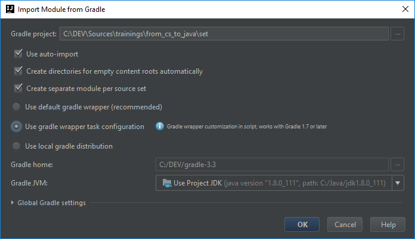
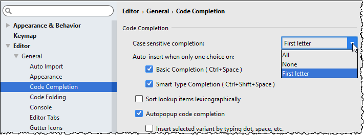

# IntelliJ

For internal use, the wiki provides a 
[Quick start guide to set-up dev environnement](https://wiki.evs.tv/display/PRENG/Quick+start+guide+to+set-up+dev+environnement) 

## Editions

The Community edition is free and allows to develop java applications supporting all JavaSE libraries

The Ultimate edition is commercial and provides lot of tools useful for enterprise application development
 as database tools, JavaEE support, Spring integration ans many more.
 
Both editions comes with 32 and 64 bits launchers. A 32 bits JRE can manage a maximum of 2Gb od memory. 
 Use the 64 bits version to be able to allocate more memory to your IDE and give it better performances.

## Project organization

IntelliJ works with two main principles
* Project
  * A project is a workspace grouping all modules concerning a global project.
  * One instance of IntelliJ works with only one project at a time but you can open multiple 
  instances of IntelliJ working on different projects.
* Module
  * A module correspond to an application or an autonomous part of an application.
  * A module has it's own classpath.
  * A module is unique inside a project but can be shared by multiple projects.
  
When you create a project or a module, technical files (*.iml) or directories (.idea) are created.
  A good practice recommends to separate those files from you source files to void adding them to
  your source control.
```
└-IdeaProjects
|└-Project1
|└-Project2
└-Sources
 └-MyLib1
 └-MyLib2
 └-MyRepo1 
```

### Project creation

  There is many ways to create a project, here is an efficient one when working with maven or gradle projects.
  
  IntelliJ will analyse the maven or gradle configuration file to configure the module, that's why
  it's better to import modules from sources then letting it create the project just after the check-out 
  operation.
  
1. Clone your project into the `Sources` directory from git, either in command line, with an external tool
or withe IntelliJ menu "VCS > Checkout from version control > git". **In this latest case, reply "no" when 
Intellij ask you to create a project with the checked out sources.**
2. Create an empty project
   1. "File > New > Project"
   2. Choose "Empty project"
   3. Set a name and locate files in your `IdeaProjects` folder
3. Set the JDK of your project if not yet set.
4. Close the dialog
5. Create a module for your project sources
   1. "File > New > Module from existing sources"
   2. Select the `build.gradle` file of your project
   3. In the "Import Project" Gradle dialog, check the three checkboxes and select "Use gradle wrapper task configuration".
   
   
   
Repeat 5 if you have multiple modules to import.  

## Configuration

 IntelliJ is full customizable, take time to show config and menus or explore documentation to take advantage of it.
 
 Here is some helpful tips.
 
### Shortcuts

The list os most used shortcuts is available on the menu "Help > Keymap reference"

To find any action inside the IDE use Find Action (`Ctrl+Shift+A`)

Some useful shortcuts :

|Action	                                        |Shortcut                     |
|-----------------------------------------------|---------------------------------|
|Basic code completion                          | `Ctrl+Space`|
|Smart Completion (context aware)               | `Ctrl+Shift+Space`|
|Statement Completion                           | `Ctrl+Shift+Enter`|
|Search everywhere	                            | `Double Shift` |
|Quick fix                                      |`Alt+Enter`|
|Documentation (Javadoc)                        | `Ctrl+Q`|
|Show usages                                    | `Ctrl+Alt+F7`|
|Move the current line of code	                | `Ctrl+Shift+Up` `Ctrl+Shift+Down`   |
|Duplicate a line of code	                    | `Ctrl+D`                          |
|Remove a line of code	                        | `Ctrl+Y`                          |
|Comment or uncomment a line of code	        | `Ctrl+Slash`                      |
|Comment a block of code	                    | `Ctrl+Shift+Slash`                |
|Find in the currently opened file	            | `Ctrl+F`                          |
|Find and replace in the current file	        | `Ctrl+R`                          |
|Next occurrence	                            | `F3`                              |
|Previous occurrence	                        | `Shift+F3`                        |
|Navigate between opened tabs	                | `Alt+Right Alt+Left`              |
|Navigate back/forward	                        | `Ctrl+Alt+Left` `Ctrl+Alt+Right`    |
|Expand or collapse a code block in the editor  | `Ctrl+NumPad plus` `Ctrl+NumPad -`  |
|Create new...	                                | `Alt+Insert`                      |
|Surround with	                                | `Ctrl+Alt+T`                      |
|Highlight usages of a symbol	                | `Ctrl+F7`                         |
|Rename	                                        |`Shift+F6`|
|Extract variable	                            |`Ctrl+Alt+V`|
|Extract field	                                |`Ctrl+Alt+F`|
|Refactor this	                                |`Ctrl+Shift+Alt+T`|
|Reformat code	                                |`Ctrl+Alt+L`|
|Auto-indent lines	                            |`Ctrl+Alt+I`|
|Optimize imports	                            |`Ctrl+Alt+O`|
|VCS Commit changes	                            |`Ctrl+K`|
|VCS Update project	                            |`Ctrl+T`|
|VCS Push commits	                            |`Ctrl+Shift+K`|
|Run	                                        |`Shift+F10`|
|Debug	                                        |`Shift+F9`|
|Debug Toggle breakpoint	                    |`Ctrl+F8`|
|Debug Step into	                            |`F7`|
|Debug Smart step into	                        |`Shift+F7`|
|Debug Step over	                            |`F8`|
|Debug Step out	                                |`Shift+F8`|
|Debug Resume	                                |`F9`|
|Debug Evaluate expression	                    |`Alt+F8`|
|Insert a live template.	|`Ctrl+J`|
|Surround with a live template.	|`Ctrl+Alt+J`|

Some often used expressions can be created by writing some letters and selecting code snippet. Here is a non exhaustive list.

|code     |   generated code                                      |
|---------|-------------------------------------------------------|
|`sout`   |`System.out.println();`                                |
|`fori`   |`for (int i = 0; i < ; i++) {  }`                      |
|`iten`   |`while (enumeration.hasMoreElements()) {`              |
|         |`Object nextElement =  enumeration.nextElement(); `    |
|         |         ` }`                                          |
|`iter`   |`for (Object o : ) { }`                                |
|`itar`   |`for (int i = 0; i < array.length; i++) {`             |
|         |              ` = array[i];`                           |
|         |      ` }`                                             |
|`psvm`   |`public static void main(String[] args) {}`            |
|`prsf`   |`private static final`                                 |

### Memory allocation
 
After installing IntelliJ you can allocate more memory to the IDE by acceding the 
"Help > Edit Custom VM Options..." menu. It will create a configuration file used to configure your JRE at startup.
  Change values of `Xms` and `Xmx` to allocate more memory. `Xms` set the memory allocation at startup,
   `Xmx` sets the maximum memory allocation.
  
  ```
  ...
  -Xms1024m
  -Xmx2048m
  ...
```

### Toolbars and menus

By default, IntelliJ hides menu, toolbars and tools boxes. You can show/hide them using `view` menu. 

### Code style

Settings can be customized for the IDE or for current project only with "File > Settings" for current project
or "File > other settings > Default settings" for entire IDE.

To change default code style (indentation, colors, braces placement,...) open settings and enter "Editor > Codestyle > Java"
section. The settings can be different for each file type.

>A wiki page explains [EVS conventions](https://wiki.evs.tv/pages/viewpage.action?pageId=22744423)

### Database tools

A database tools allows you to configure database connections and provides an SQL editor.

1. Click on Database tool window
2. Clock on green plus icon to create a new datasource and select the database type
3. Enter database connection info and click on the "Download drivers" on bottom of window if's the first time you
crete a connection for this type of database.
4. Click on test connection button.

You can navigate on schema. By double clicking a table, you open a grid view editable tab.

The black window icon on top of database tool window opens a SQL console.
 
### Version control
 
 If your sources are linked to a VCS as git, a `Version Control` tool windows shows the local modifications, the log,
  the console og git commands,...
  
 The local history can manage multiple change lists to organize your modified files into separate tasks. You can commit
  a change list in one operation by right clicking on the change list name. The commit message is the change list name by default
  
 A wiki page explains [how to link IntelliJ and Jira](https://wiki.evs.tv/pages/viewpage.action?pageId=28250345)
  to create change lists based on Jira issue information 

### Plugins

 A lot of plugins are available. You can install them through the settings windows.

 By default, the internal plugins list is display, those plugins manage classical frameworks or general purposes.
 
 You can click on `Browse repositories` button to search for third parties plugins. Interesting plugins are:
 * .ignore
 * Git Flow
 * Gradle
 * Groovy
 * SonarLint
 * Grep Console
 * String Manipulation
 
Warning, the wiki talks about `Save Action` plugin, by experience, this plugin is awful due to lags and side effects.
 
 When you open a file with an extension linked to an non installed existing plugin, IntelliJ propose to install it.
 
 Remember that your IDE could start less faster if you install too much plugins... 

### Code completion case sensitivity

By default IntelliJ IDEA code completion case sensitivity only affects the first letter you type. 
This strategy can be changed in the Settings/Preferences dialog, Editor | General | Code Completion, 
so you can make to either make the IDE sensitive to all letters or make it insensitive to the case at all, 
based on what better fits your preferences.



### Type migration
When you refactor, you usually rename symbols, or extract and move statements in the code.
 However, there’s more to refactoring than just that. For example, Type Migration 
 (available via `Ctrl+Shift+F6`) lets you change the type for a variable, field, parameter or a method’s 
 return value `(int → String`, `int → Long`, etc), update the dependant code, and resolve possible conflicts.

## References

* [Discover IntelliJ](https://www.jetbrains.com/help/idea/2017.1/discover-intellij-idea.html#EditorBasics)
* [IntelliJ documentation](https://www.jetbrains.com/idea/documentation/)
* [Youtube IntelliJ channel](https://www.youtube.com/user/intellijideavideo)