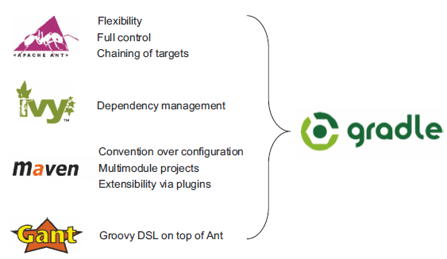
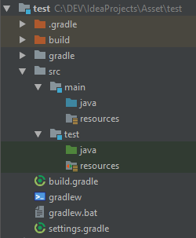
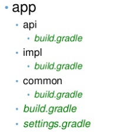

# Gradle build tool

## Why a build tool ?

When developing java applications the same problems occurs each time
* Dependencies management
* Compilation automation
* Test automation
* Bundle deploy
* ...

### The solutions

Home made solutions was not convenient, shared folder with jars, batch files,... that's why
 a first generation of solution was created by Apache with `Ant`. Ant is a scripting tool
 allowing developers to automate steps manipulating code and generating different output as
 documentation, binaries, bundles,...
  
A second generation of solutions give us `Ivy` and `Maven`, a more powerful tool based on Ant and mainly
 based on the `convention over configuration` principle. Maven is used in 70% of java projects
 and provides a new concept for dependencies management. Each jar is defined by a `groupId`, an `artifactId`
 and a `version`. All those jars (called `dependencies` or `artifacts`) are stored on public `repositories`
 to be downloaded when needed. More important, each artifact knows its own dependencies and Maven can
 download the dependencies of your dependencies also called `transitive dependencies`. As is, you just define
 your own dependencies without taking care about the transitive dependencies.
  
In parallel, somme tolls were created to manage the repositories. Some public repositories are storing
a lot of common artifacts and products as `Nexus` or `Artifactory` allows companies to store an internal
repository to share internal artifacts inside the company and used as proxies for public artifacts.

The last generation is represented by `Gradle` which use the largely deployed Maven and Ivy repositories,
use the same conventions but provide a scripting configuration mechanism based on `Groovy` instead
of a static XML definition file. In fact Gradle is based on Maven conventions but provide a scripting
way to use them.


## Gradle description

Gradle provides:

* A very flexible general purpose build tool like Ant.
* Switchable, build-by-convention frameworks a la Maven. But we never lock you in!
* Very powerful support for multi-project builds.
* Very powerful dependency management (based on Apache Ivy).
* Full support for your existing Maven or Ivy repository infrastructure.
* Support for transitive dependency management without the need for remote repositories or pom.xml and ivy.xml files.
* Ant tasks and builds as first class citizens.
* Groovy build scripts.
* A rich domain model for describing your build.



## Project conventions

### Build file

The entry point of a Gradle project is the `build.gradle` file. It's placed on the root of the project.

### Gradle default project layout

A Gradle java project assumes to be structured as this 




## DSL the Domain Specific Language

[Gradle DSL reference](https://docs.gradle.org/current/dsl/)

* Gradle is composed of two concepts
  * `Projects` : may represent the creation of a jar or a full deploy of an application on a server.
  A project is composed of several tasks
  * `Tasks` : some atomic job

Example of a gradle task

``` Groovy
task hello {
    doLast {
        println 'Hello world!'
    }
}

task count {
    doLast {
        4.times { print "$it " }
    }
}
```

Gradle allows to setup default tasks (executed if no other task specified)
 and dependencies between tasks

``` Groovy
defaultTasks 'clean', 'compile'

task clean {
    doLast {
        println 'clean something'
    }
 }
 
task compile {
    doLast {
        println 'compile code'
    }
 }
 
task other(dependsOn: 'compile') {
    doLast {
        println 'not a default task'
    }
  }
```

Gradle provides plugins to simplify tasks usage

``` Groovy
// Import the plugin to make build of a java project
apply plugin: 'java' 
```

A simple java project would be configured as this

``` Groovy
// Import the plugin to make build of a java project

group 'com.evs.training'
version = '1.0-SNAPSHOT'

apply plugin: 'java'

repositories {
    mavenCentral()
    maven {
        url "http://searchservicepoc.evs.tv:8081/repository/maven-snapshots/"
    }
}

dependencies {

   compile('com.fasterxml.jackson.datatype:jackson-datatype-jsr310:2.8.5')
   testCompile('com.google.guava:guava:21.0')
}

```

Each IDE has plugins to manage gradle projects. They configure the environment based on the
 gradle files content. You don't have to manage yourself the path, source level,... the plugin
 change the IDE configuration when you change the gradle files.
 
> Gradle projects are IDE agnostics. No need to share IDE configuration files, everything
is in the gradle files. **Never commit IDE configuration files in your VCS !**

### Manage multiple projects

Multi projects allows to separate purposes into a single build model
 
 

File `settings.gradle` defines the project structure.
By default, Gradle uses the name of the directory as name of subproject and finds the settings.gradle 
location to determine the name of the root project.

``` Groovy
include 'common'
include 'api'
include 'impl'
``` 

The build.gradle file can apply general configuration for all or sub projects

``` Groovy
allprojects {
  group 'com.evs.training'
  version = '1.0-SNAPSHOT'
}

subprojects {
  apply plugin: 'java'  
}
``` 

Dependencies can be defined between projects

``` Groovy
dependencies {
  compile project(':common')
  compile project(':api')
}
``` 

### Source sets

Gradle allows you to group sources as a `source set` example of source sets are

* Unit tests
* Integration tests
* tools (a test client for your server project)

You can apply dependencies, tasks and so on on different source sets, by this way you can create multiple
jars or exclude tools from your build result,...

### Dependency management

Gradle supports both Maven and Ivy dependencies mechanisms. Here is a list of good practices recommended
 by gradle team about dependency management
 
* Put the Version in the Filename (Version the jar)
  * Its more clear to prevent dependency conflict and be warned if different jars of a same project
   as Hibernate are not in the same version
* Manage transitive dependencies
  * Only refer to first level dependency to avoid a spaghetti dependencies schema
* Resolve version conflicts
  * If two transitive dependencies has different versions, force one of them by checking api's differences
      guarantying a wanted comportment to your application.
* Use Dynamic Versions and Changing Modules
  * Use -SNAPSHOT versions of in-development dependencies and RELEASE versions of others
  
Dependencies can be declared by multiple ways

|Type	|Description|
|----|----|
|External module dependency	|A dependency on an external module in some repository.|
|Project dependency	|A dependency on another project in the same build.|
|File dependency	|A dependency on a set of files on the local filesystem.|
|Client module dependency	|A dependency on an external module, where the artifacts are located in some repository but the module meta-data is specified by the local build. You use this kind of dependency when you want to override the meta-data for the module.|
|Gradle API dependency	|A dependency on the API of the current Gradle version. You use this kind of dependency when you are developing custom Gradle plugins and task types.|
|Local Groovy dependency	|A dependency on the Groovy version used by the current Gradle version. You use this kind of dependency when you are developing custom Gradle plugins and task types.|

#### External module dependencies

External module dependencies are the most common dependencies. They refer to a module in an external repository.

``` Groovy
dependencies {
    runtime group: 'org.springframework', name: 'spring-core', version: '2.5'
    runtime 'org.springframework:spring-core:2.5',
            'org.springframework:spring-aop:2.5'
    runtime(
        [group: 'org.springframework', name: 'spring-core', version: '2.5'],
        [group: 'org.springframework', name: 'spring-aop', version: '2.5']
    )
    runtime('org.hibernate:hibernate:3.0.5') {
        transitive = true
    }
    runtime group: 'org.hibernate', name: 'hibernate', version: '3.0.5', transitive: true
    runtime(group: 'org.hibernate', name: 'hibernate', version: '3.0.5') {
        transitive = true
    }
}
``` 

#### Client module dependencies

Client module dependencies allow you to declare transitive dependencies directly in the build
 script. They are a replacement for a module descriptor in an external repository.

``` Groovy
dependencies {
    runtime module("org.codehaus.groovy:groovy:2.4.10") {
        dependency("commons-cli:commons-cli:1.0") {
            transitive = false
        }
        module(group: 'org.apache.ant', name: 'ant', version: '1.9.6') {
            dependencies "org.apache.ant:ant-launcher:1.9.6@jar",
                         "org.apache.ant:ant-junit:1.9.6"
        }
    }
}
``` 

#### Project dependencies

Gradle distinguishes between external dependencies and dependencies on projects which are part 
of the same multi-project build. For the latter you can declare Project Dependencies.

``` Groovy
dependencies {
    compile project(':shared')
}
```

#### File dependencies
File dependencies allow you to directly add a set of files to a configuration, without first adding
 them to a repository. This can be useful if you cannot, or do not want to, place certain files in a
  repository. Or if you do not want to use any repositories at all for storing your dependencies.
     
To add some files as a dependency for a configuration, you simply pass a file collection as a 
dependency:
     
``` Groovy
dependencies {
    runtime files('libs/a.jar', 'libs/b.jar')
    runtime fileTree(dir: 'libs', include: '*.jar')
}
``` 

#### Gradle API Dependency
You can declare a dependency on the API of the current version of Gradle by using the 
DependencyHandler.gradleApi() method. This is useful when you are developing custom Gradle 
tasks or plugins.
     
``` Groovy
 dependencies {
     compile gradleApi()
 }
``` 

#### Local Groovy Dependency
You can declare a dependency on the Groovy that is distributed with Gradle by using the 
DependencyHandler.localGroovy() method. This is useful when you are developing custom Gradle 
tasks or plugins in Groovy.
     
``` Groovy
dependencies {
    compile localGroovy()
}
``` 

#### Excluding transitive dependencies

You can exclude a transitive dependency either by configuration or by dependency:

``` Groovy
configurations {
    compile.exclude module: 'commons'
    all*.exclude group: 'org.gradle.test.excludes', module: 'reports'
}

dependencies {
    compile("org.gradle.test.excludes:api:1.0") {
        exclude module: 'shared'
    }
}
``` 

### Publishing artifacts

If the result of your build must be published on a maven repository (such as for library projects),
use the `uploadArchive` plugin.

``` Groovy
apply plugin: 'maven'

uploadArchives {
    repositories {
        mavenDeployer {
            repository(url: "file://localhost/tmp/myRepo/")
        }
    }
}
``` 

### Project properties

You can define properties available in your projet. By default, gradle sets some properties

|Name	            |Type	        |Default Value                              |
|:-----------------:|:-------------:|-------------------------------------------|
|project	        |Project	    |The Project instance                       |
|name	            |String	        |The name of the project directory.         |
|path	            |String	        |The absolute path of the project.          |
|description	    |String         |A description for the project.             |
|projectDir     	|File	        |The directory containing the build script. |
|buildDir	        |File	        |projectDir/build                           |
|group	            |Object	        |unspecified                                |
|version	        |Object	        |unspecified                                |
|ant	            |AntBuilder	    |An AntBuilder instance                     |

You can define local variables

``` Groovy
def dest = "dest"

task copy(type: Copy) {
    from "source"
    into dest
}
```

### Gradle wrapper

To avoid local installation, it's possible to include a gradle wrapper into the project.
 The wraper is named `gradlew`, the version of gradle used by the wraper is defined in
 the build.gradle file.

## References

* [Official Gradle site](https://gradle.org/)
* [Gradle DSL reference](https://docs.gradle.org/current/dsl/)
* [Gradle Slideshare presentation](https://fr.slideshare.net/jadsonjs/gradle-53757208)

## Books

* [Gradle in Action](https://www.manning.com/books/gradle-in-action)
* [Mastering Gradle](https://books.google.be/books/about/Mastering_Gradle.html?id=9qFNCgAAQBAJ&source=kp_cover&redir_esc=y&hl=fr)
* [Gradle Beyond the Basics](http://shop.oreilly.com/product/0636920019923.do?sortby=publicationDate)

